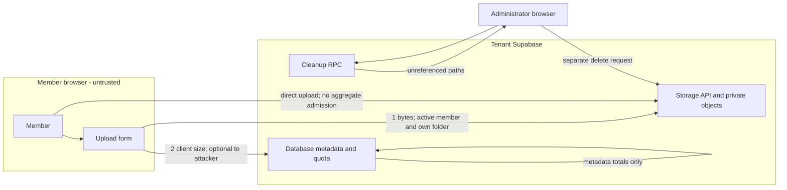
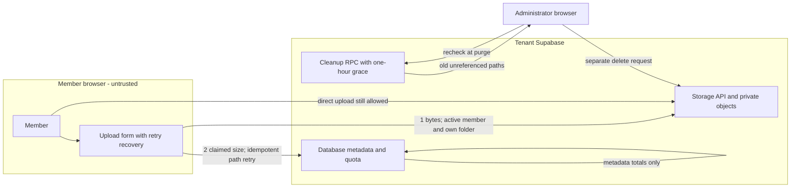
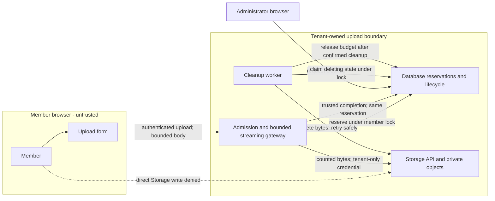

# Security Hardening Proposal: Own storage admission and object lifetime together

## Decision

We need to decide whether a configured tenant storage cap is a cooperative usage allowance or an enforced boundary against admitted members. The current code supports the first interpretation. If we require the second, the component that permits bytes into Storage must participate in capacity accounting and object lifetime.

## Executive Recommendation

Our complete option set is **Option 1: metadata accounting with stronger recovery** and **Option 2: tenant-owned admission, reservations and bounded upload gateway**. Option 1 preserves the existing direct browser path and remains a valid low-operation-cost choice for trusted groups. Option 2 would route uploads through a tenant-owned service, reserve capacity before streaming and keep unfinished or deleting objects charged until cleanup is confirmed.

I recommend validating Option 2 when strict resource isolation is a product requirement. We should keep the tested tactical protections from Option 1 during that work. This recommendation does not authorize or claim implementation, and it is conditional on proving the hosted Storage protocol and an acceptable service budget.

## Evidence

I read the canonical quota finding and the original SQL during the baseline audit, then reopened the current quota trigger, Storage policies, UploadForm and AdminStorage. The quota/control placement, rather than a particular UI failure, is what supports this proposal.

| Evidence | Finding or document | What it establishes |
| --- | --- | --- |
| storage-quota-bypass | Members can bypass the configured storage quota through direct uploads | Canonical finding: Storage INSERT checks active membership and own folder, while a separate files INSERT trigger totals client-supplied size_bytes. An attacker can omit or understate metadata. |
| SQL-CURRENT | Current tenant quota and Storage policies | db/tenant-schema.sql:609 and :1300 preserve that separation. The per-object bucket cap still limits each object; null member quota intentionally means unlimited. |
| UPLOAD-CURRENT | Current upload and retry workflow | src/components/dept/UploadForm.tsx:159 uploads bytes before metadata and now retains uncertain writes/retries by a stable path. An attacker need not use this form. |
| CLEANUP-CURRENT | Current cleanup grace and purge recheck | db/tenant-schema.sql:824 and src/components/admin/AdminStorage.tsx:77 exclude new/referenced objects and repeat the list before deletion, but the list and Storage removal remain separate requests. |
| CLEANUP-TEST | Local cleanup regression | db/test/04-tenant-security-regressions.sql tests old unreferenced, recent unreferenced and old referenced objects. The recent-object assertion failed before the SQL grace change and passes afterward. |

**Observed:** the original scan targets revision `ebe4fabb10b4ab8eb5dcc6eed4ede372f76a0c80`; its canonical code evidence remains an original-snapshot account. The current worktree has authorized changes. Both versions allow direct uploads outside aggregate metadata accounting. Current local SQL runs pass 148 tenant and 52 control assertions, with three cleanup cases; we did not test real hosted Storage uploads or multi-session throughput.

**Inferred:** accounting and cleanup share a missing lifecycle owner. We admit bytes under a Storage policy, account for a separate browser-created row, and later infer that an unreferenced object is abandoned. That inference is reasonable for ordinary failures but cannot enforce intent against an adversarial member or prove absence of a delayed metadata write. A durable state transition at an owned boundary would let us make those claims explicit.

## Current Design And Failure Mode

An active member can call the tenant Storage API directly with the public project key and their own session. The policy permits an object in that member's folder. The bucket applies a per-object size ceiling, but neither that policy nor the upload caller reserves aggregate capacity. The metadata trigger later sums files.size_bytes and rejects a new row if its claimed size exceeds the configured member limit.

We therefore pay for bytes before asking the aggregate question, and the actor who should be constrained chooses whether to ask it at all. A browser rollback helps an honest failed upload. It cannot constrain a direct API caller, and an unreferenced object remains stored until an administrator cleans it up. Setting size_bytes to zero is another route through the same trust gap.

The current recovery fixes reduce accidental loss. A lost metadata response is reconciled by the same unique path before retry or deletion; a one-hour grace protects normal in-flight uploads from orphan listing; a second list narrows stale cleanup decisions. We still cannot make a list-and-delete pair atomic across services. A delayed metadata insertion after the final list can race deletion, and the window is only reduced by the grace. Administrators already have legitimate authority to delete archive content; this lifecycle concern is accidental data loss, not a new administrator privilege escalation.

## Desired Invariants

We would make these behaviors falsifiable:

- With a finite cap, confirmed bytes plus reserved capacity never exceed the member's cap when a new upload is admitted, including concurrent requests and abandoned uploads.
- Every stored object is tied to exactly one tenant/member/path reservation; a member cannot upload through a second unaccounted API path.
- The byte consumer enforces the reserved upper bound independently of client metadata and Content-Length.
- Retrying completion is idempotent; a completed object has trusted size metadata and one file record.
- An object being deleted cannot concurrently become a completed file. Capacity is released only after the provider confirms removal or trustworthy absence.
- Expired reservations and failed deletes are visible, retryable and bounded; a worker crash cannot silently forget charged objects.

## Constraints And Non-Goals

We preserve department-owned storage and authentication. We do not transfer a standing service key to the OpenDepartment host, relax private read policy, or let an ordinary member delete another member's bytes. Existing owner/admin deletion checks and insert-column fences remain required.

We assume no supplied performance or memory budget. We should measure a representative small archive workload and maximum-size uploads on the intended tenant runtime before setting thresholds. Content malware scanning, stronger anonymity, tenant administrators' legitimate deletion powers, global account quotas and a platform-wide upload service are outside this opportunity. We are not proposing a speculative trigger on storage.objects: its lifecycle and trusted metadata semantics have not been validated against hosted Supabase.

## Before Architecture

The original structure has two separate successful requests, with the browser deciding whether the second follows the first:

The direct member-to-Storage edge is the significant one. A function around files INSERT cannot govern it. Cleanup similarly receives a list and uses a later API call, so object lifetime has no shared transaction with metadata lifetime.

## Options

### Option 1: Metadata accounting with stronger recovery

We can preserve direct browser uploads and make the cooperative path more reliable. Current work already preserves the storage path across uncertain metadata responses, retries subject links without duplicate upload, and adds age grace plus a purge-time orphan recheck. We can document the displayed total as registered metadata usage, make quota refusals and failed cleanup visible, and retain per-object size ceilings.

This is attractive because it requires no additional always-available service and keeps bytes flowing directly from the browser to tenant Storage. SQL checks and UI retries remain familiar to maintainers. Recovery adds queries on failed or repeated operations and an extra list before purge; it does not place a new hop on the successful upload's byte stream. Memory stays dominated by existing browser file handling rather than a new server buffer.

We should accept the security limitation explicitly if we choose this option. A member can continue to omit metadata, understate sizes and exhaust the shared tenant allowance. Even a database lock around metadata totals would serialize the wrong inputs. A grace period cannot prove abandonment, and a second query cannot prevent a later file insert. These controls mitigate operational mistakes; they do not close the canonical quota finding.

Rollout is the existing app deployment plus reapplication of tenant SQL. The SQL RPC retains its response shape and adds a time filter, so older clients remain compatible. We can reverse UI presentation changes independently, but should retain recovery tests and the grace/recheck protections. If we later adopt Option 2, these retries remain useful while old requests drain.

| Change | Before | After | Security consequence | Cost |
| --- | --- | --- | --- | --- |
| Uncertain metadata response | Browser could delete bytes despite a committed row | Reconcile and retry the same path | Reduces accidental deletion/duplication | Extra queries on retry/failure |
| Orphan selection | Unreferenced at first listing | Older than one hour and rechecked before purge | Narrows in-flight cleanup race | Delayed reclamation and another query |
| Aggregate authority | Client claims after upload | Same boundary, clearly described | Direct-upload bypass remains | No new service |

We keep the fast path, but we also retain its trust assumption. The delayed cleanup is a useful tradeoff for ordinary uploads; an operator who needs a hard cap must not confuse the quieter failure behavior with enforced capacity.

### Option 2: Tenant-owned admission, reservations and bounded upload gateway

We can introduce a tenant-owned service that verifies the current member, reserves capacity under a per-member database lock and only then accepts the upload stream. The reservation records tenant, member, a server-generated immutable object path, a byte upper bound, expiry and lifecycle state. The member cannot edit its accounting fields. The service counts actual bytes while streaming and aborts if the reservation bound is exceeded, regardless of Content-Length or MIME claims. A declared upper bound can be useful input, but the byte consumer must enforce it.

The essential companion change is to deny ordinary direct Storage writes. Merely issuing a reservation while leaving the current folder policy intact would preserve the bypass. The gateway's credential would live only in the tenant runtime; the OpenDepartment host would continue to hold no standing tenant administrator key. Where the runtime only offers a broad service credential, that is a new trusted component with significant blast radius. We would isolate its configuration, verify the tenant identity independently, restrict accepted object paths and operations in code, and test that arbitrary SQL, paths or member IDs never reach privileged APIs.

After a successful upload, the gateway verifies provider-reported object identity/size against its own count and transitions the reservation to complete in the same database transaction that creates the file row. Direct file insertion must then be replaced by that completion interface. On a lost response, completion can return the existing file for the same reservation. We cannot atomically commit remote object bytes and a SQL row, so pending and deleting states are durable rather than pretending the two services share a transaction.

Cleanup claims an expired pending object under the same state lock. Once marked deleting, completion is refused. The worker removes bytes through the Storage API, retries uncertain outcomes safely, and releases charged capacity only after confirmed removal or reliable absence. This removes the metadata-after-list race within the proposed owned path. We still need provider-specific tests for deletion acknowledgment, replacement semantics and failed or partial uploads. A stuck worker may temporarily reduce available capacity; failing closed is intentional and must be observable and recoverable.

This option adds an admission round trip, lock contention for concurrent uploads by one member, and a streaming hop for all bytes. We should not buffer an entire file in an edge function; bounded buffering and backpressure are design requirements whose feasibility depends on the tenant runtime. Reservations, indexes and durable cleanup state add database rows; pending capacity remains reserved during outages. The worker adds deployment, monitoring and retry operation costs across tenant projects. These are meaningful costs, which is why a source-only review cannot justify switching every department immediately.

We could prototype the service in a disposable hosted project, then migrate one opt-in tenant with a temporary upload pause. We would inventory existing objects using trusted provider metadata, reconcile missing rows and reserve old unresolved bytes conservatively before switching policies. Reads remain available. Old client upload requests must fail visibly after the gate changes, rather than silently falling back to the old policy. Rollback would pause new writes, drain or clean reservations and restore the old API only with an explicit soft-quota decision; restoring unrestricted writes is not a security-preserving rollback.

We should defer a direct signed-upload optimization until a hosted experiment proves an unforgeable per-upload byte ceiling, single-path/single-use semantics, and the absence of an alternate write route. An existence-only RLS reservation or an assumed signed-URL size restriction is insufficient evidence. A tenant-local streaming gateway is the concrete stronger boundary evaluated here, not a claim about undocumented provider features.

| Change | Before | After | Security consequence | Cost |
| --- | --- | --- | --- | --- |
| Upload authority | Member may write any own-folder object | Only tenant gateway admits reserved paths | Removes unaccounted direct writes if every route is denied | New privileged service and migration |
| Quota input | Client size after object creation | Locked reservation before independently bounded stream | Caps concurrent admitted bytes, including pending objects | Admission hop, locks and metering |
| Completion | Client inserts file metadata | Trusted idempotent lifecycle transition | Prevents understated sizes and duplicate completion | New API and compatibility work |
| Cleanup | Query list then delete, with grace/recheck | Claim deleting state, reject completion, delete, release | Removes attach-after-selection race in the owned path | Durable worker and retry state |
| Tenant isolation | Project-local database and Storage | Same tenant, additional project-local service | Platform still has no standing tenant key | Tenant deployment and credential operations |

The gateway becomes the place where we must review authority, input limits and resource behavior together. That concentration makes the invariant testable, but it also means gateway availability and credential handling become first-class operating responsibilities.

## Comparison

These are expected mechanisms, not measured speedups or capacity estimates. Confidence concerns the direction, not an unstated magnitude. We have only measured the local SQL regression outcome.

| Dimension | Option 1: metadata/recovery | Option 2: admission gateway | Basis, confidence and validation |
| --- | --- | --- | --- |
| Security | Mitigates recovery loss; quota bypass unaffected | Expected strict admission and lifecycle enforcement; privileged gateway is new risk | Source-derived high for baseline; hypothetical medium for candidate. Test direct APIs, false sizes, replays and all lifecycle races. |
| Performance | Normal byte path unchanged; extra recovery/list queries | Extra admission hop, streaming hop and per-member lock | Source-derived medium / hypothetical medium. Compare successful upload p50/p95, throughput and lock waits for one and many members at small and maximum object sizes. Decide acceptable threshold before rollout. |
| Memory/resources | No new runtime; existing file and metadata buffers | Bounded stream buffers plus reservation/index/queue growth; pending bytes stay charged | Source-derived medium / hypothetical medium. Measure browser heap, gateway peak memory, pending rows and stored bytes under slow/aborted streams; reject unbounded growth. |
| Reliability | Better retries; cross-service race remains | Durable state supports retry, but gateway/worker outages stop admissions or delay reclamation | Source-derived medium / hypothetical medium. Inject response loss and crashes at every transition; verify no missing completed object and no prematurely released quota. |
| Operability | Existing SQL/app release; show cleanup failures | Per-tenant service, secrets, worker health, stuck reservation metrics and repair procedure | Source-derived high / hypothetical medium. Trial deployment, rotation, worker stop/restart and operator recovery in an isolated tenant. |
| Migration | Compatible RPC shape; apply SQL and deploy app | Inventory actual objects, new API, policy cutover and old-client coordination | Source-derived high / hypothetical medium. Dry-run migration on mixed valid/orphan fixtures and prove direct-write denial before reopening uploads. |
| Developer ergonomics | Familiar split APIs; future callers can omit recovery | One lifecycle API centralizes rules; more state transitions to maintain | Source-derived high / hypothetical medium. Review a new upload caller and run contract tests without duplicating policy. |
| Reversibility | App changes reversible; retain safety guards | Requires pausing writes and resolving pending states before restoring old contract | Source-derived high / hypothetical medium. Rehearse cutover and rollback without losing objects or silently changing the quota promise. |

The strongest cost argument for Option 1 is operational simplicity. The strongest security argument for Option 2 is that we can test admission before consuming a shared resource. Neither cost is a reason to hide the weaker option's residual risk or the stronger option's new privileged component.

## Recommendation

I recommend Option 2 for a finite quota presented as a security control, subject to a successful hosted prototype and an agreed runtime budget. We should keep Option 1 in production while validating the candidate and describe its allowance accurately. If operators prefer direct uploads and accept risk from admitted members, Option 1 is a reasonable final choice. If the runtime cannot stream with bounded memory or cannot deny every direct write route, we should not claim the candidate meets its invariants; we would revisit the design or keep the soft allowance.

## Evidence Coverage And Residual Risk

| Evidence | Option 1 | Option 2 | Tactical protection still required |
| --- | --- | --- | --- |
| storage-quota-bypass — Direct uploads bypass member quota | Unaffected | Addresses, contingent on implementation and hosted validation | Per-object bucket ceiling, active-member checks and current quota checks during migration |
| UPLOAD-CURRENT — Separate upload and metadata retry path | Mitigates accidental failure through stable-path recovery | Addresses through durable idempotent completion; remote bytes/SQL still require recovery | Retain safe uncertain-response handling; never delete bytes solely because a response was lost |
| CLEANUP-CURRENT / CLEANUP-TEST — Orphan cleanup race and grace regression | Mitigates; final list-to-delete race remains | Addresses owned-path race with deleting state that excludes completion | Keep grace/recheck for legacy objects and validate state transitions before removing the fallback |

Other scan findings are unaffected by this opportunity; their authentication, account binding, founder capability and column-privilege fixes remain independently necessary. A privileged tenant administrator or compromised gateway may still destroy tenant data within that authority. The proposal neither changes the provider's own storage billing guarantees nor promises reclaim timing before hosted behavior is measured.

## Migration And Rollout

We would first preserve the current protections and characterize hosted behavior in a project containing synthetic data. An opt-in migration needs a truthful inventory of object sizes, missing metadata, existing signed-upload capabilities and active uploads. Unknown object state must be charged conservatively or reconciled during a write pause; it cannot be ignored to make the new totals look correct.

A pilot would deploy the gateway and worker before switching clients and deny direct writes before accepting uploads under the strict guarantee. We would retain read availability and give old clients an explicit reload/update error. Quota and lifecycle metrics must show pending bytes, completed bytes, deleting objects, oldest stuck reservation, and reconciliation differences without logging member tokens or upload content.

Rollback is a rehearsed maintenance operation: pause new admissions, finish or clean outstanding states, verify object/accounting agreement, then select either the older soft-quota API or a repaired gateway. We should never silently reopen folder writes while continuing to display a strict guarantee.

## Validation Plan

We can use SQL tests for atomic reservation transitions and authorization, but we need real concurrent database sessions for lock behavior and the hosted Storage service for byte-consumption semantics. No test against the shim proves Storage rejects a bad upload.

The security matrix should include zero/understated sizes, absent or false Content-Length, chunked bodies beyond the bound, direct Storage POST/PUT/upsert routes, signed upload capabilities issued before cutover, stolen/replayed reservations, other-member paths, banned users, duplicate finalize calls and cap changes during active uploads. Every rejected request must leave capacity either unused or explicitly charged until confirmed cleanup.

We would interrupt the gateway and worker before and after reserve, upload completion, metadata commit, deleting-state claim, Storage deletion and budget release. A completed file must retain its object; an expired/deleting reservation must never finalize; uncertain removal must not release capacity early. A migration fixture should include existing orphans and missing objects, with rollback preserving all completed objects.

For performance, compare the current direct upload with the candidate using identical small and maximum-size objects, slow clients, same-member concurrency and many-member concurrency. Record end-to-end latency, throughput, lock wait, bounded-buffer peak memory, reservation growth and reclamation lag. Agree thresholds from the pilot's intended runtime and budget before accepting the candidate; this analysis supplies no invented numbers.

## Implementation Work Packages

These are proposal-level packages, not a selected implementation plan: specify the admission/completion/delete contract and role grants; prototype bounded streaming and hosted provider semantics; add locked reservation/state transitions and adversarial tests; build retryable cleanup and visibility; rehearse inventory/cutover/rollback on synthetic tenants; pilot an opt-in tenant. Acceptance requires all invariants above and an agreed service budget. An implementation plan should be written only after option selection and a refreshed source-drift check.

## Open Questions

- Which tenant runtime can host bounded streaming and a durable cleanup worker within the operator's budget?
- Can we eliminate broad gateway credentials through a narrower supported authority without relying on unverified provider behavior?
- What constitutes confirmed removal/absence for failed or partial uploads, and how do old signed capabilities behave after policy cutover?
- How long may legitimate uploads reserve capacity, and what recovery flow should an operator use for a stuck reservation?
- Is the product willing to keep a soft allowance for trusted groups, or must every finite cap be enforced against malicious members?

